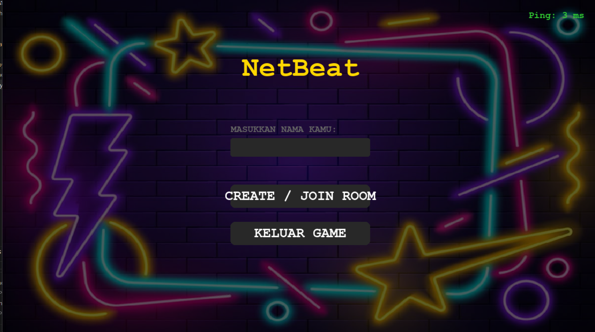
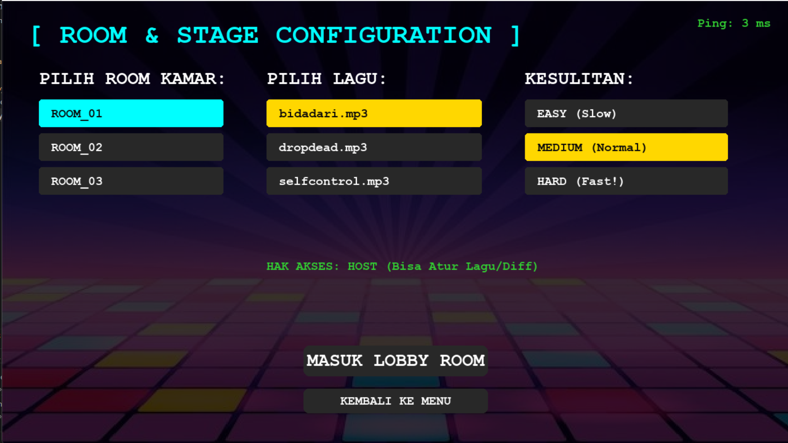
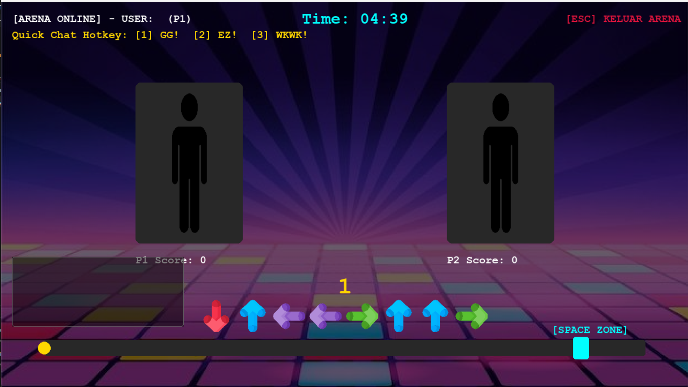

[](https://classroom.github.com/a/4SHtB1vz)

# NetBeat — Network-Based Multiplayer Rhythm Game

> Final Project Pemrograman Jaringan — Semester Genap 2025/2026
> Departemen Teknik Informatika, ITS

**Tech Stack:** Python · Socket (TCP) · Pygame · JSON

**Anggota:**
- Bara Semangat Rohmani (5025241144)
- Naufaldi Faqih Abimanyu (5025241184)

---

## 📖 Deskripsi

NetBeat adalah game *multiplayer* berbasis jaringan (*network-driven multiplayer 
rhythm game*) bergenre *rhythm*/*dance*, di mana dua pemain terhubung melalui *server* 
untuk bermain secara *real-time*. Pemain menekan tombol Spacebar mengikuti pola 
panah 8 arah sesuai irama lagu, dengan akurasi ketukan dinilai menjadi Perfect, 
Great, atau Miss. Skor dan status permainan masing-masing pemain disinkronkan 
secara *real-time* ke lawan melalui *server*.

## ✨ Fitur

| Fitur | Keterangan |
|---|---|
| *Real-time State Sync* | Skor, animasi, dan *feedback* ketukan tersinkron antar pemain |
| *Room System* | Mendukung 3 *room* (ROOM_01–03), masing-masing 2 pemain |
| *Dynamic Room Transfer* | Pemain dapat berpindah *room* tanpa *restart* koneksi |
| *Matchmaking / Ready Check* | Permainan dimulai otomatis saat kedua pemain *ready* |
| *Latency Indicator* | Heartbeat PING-PONG menampilkan *ping real-time* |
| *Server Logging* | Aktivitas koneksi, *room*, dan paket dicatat ke `server_network.log` |
| *Disconnect Handling* | *Server* tetap stabil saat salah satu *client* terputus mendadak |

## 🖼️ Preview

| *Main Menu* | *Lobby* | *Gameplay* |
|---|---|---|
|  |  |  |

## 🏗️ Arsitektur & Protokol

- **Arsitektur**: *Client-Server* terpusat (*Dedicated Authority*), *multi-threading*
- **Protokol Transport**: TCP — dipilih untuk menjamin keandalan pengiriman *state* 
  (skor, *room config*) pada paket berukuran kecil (~100–196 byte/paket)
- **Protokol Aplikasi**: *Custom*, berbasis JSON dengan *key* `type` sebagai *identifier*
- Detail lengkap: lihat [Laporan Project](docs/Laporan_NetBeat.pdf)

## 🚀 Cara Menjalankan

### Requirements
```bash
pip install pygame
```

### 1. Jalankan Server
```bash
python server.py
```
*Server* berjalan di *port* `5025` (*default* `0.0.0.0`, menerima koneksi dari semua *interface*).

### 2. Jalankan Client
```bash
python main.py
```

> Jika *client* dijalankan di perangkat berbeda dari *server*, ubah `SERVER_IP` 
> di `main.py` menjadi IP *address* *server*.

### 3. Bermain
1. Masukkan nama pemain di Main Menu
2. Pilih **Create/Join Room** → pilih *room*, lagu, dan tingkat kesulitan (Host saja)
3. Klik **Ready** — permainan dimulai otomatis saat kedua pemain *ready*
4. Tekan **Spacebar** saat panah masuk ke Space Zone

## 🎮 Kontrol

| Tombol | Aksi |
|---|---|
| Spacebar | Eksekusi ketukan (Perfect/Great/Miss) |
| Mouse | Navigasi menu, pilih *room*, lagu, dan tingkat kesulitan |
| ESC / Tombol Kembali | Kembali ke lobby/menu |

## 📁 Struktur *Project*

```
.
└── NetBeat/
    ├── server.py              # *Dedicated game server* (TCP, *multi-threading*)
    ├── main.py                # *Entry point client & game loop*
    ├── scenes.py              # *Rendering* menu, *room config*, *lobby*
    ├── gameplay.py            # Logika & *rendering gameplay* inti
    ├── server_network.log     # *Log* aktivitas *server* (*auto-generated*)
    ├── Image/                 # *Asset* gambar (wajib ada di *root*)
    ├── Song/                  # *Asset* musik (wajib ada di *root*)
    └── pycache/               # *Compiled Python bytecode* (*auto-generated*, *git ignore*)
      ├── gameplay.cpython-313.pyc
      └── scenes.cpython-313.pyc
```

## 🎥 Video Demo

[Link video demo](https://youtu.be/j8xozjCvX4s)

## 📄 Laporan

Laporan lengkap mencakup arsitektur, desain protokol, hasil pengujian, dan 
analisis tersedia di [`docs/Laporan_NetBeat.pdf`](docs/Laporan_NetBeat.pdf).
